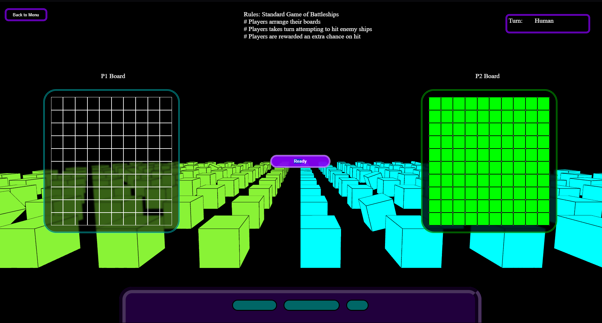

# 🛳️ Battleships

> A fully interactive, strategic Battleship game with **3D visuals**, **camera transitions**, and a challenging **AI opponent** built with **Three.js**, **GSAP**, and modular JavaScript.

---

---

## 🎮 Live Demo

👉 [Play Now](https://44ry4n.github.io/battleships/)

---

## 🧠 Features

- 🎲 **Two Game Modes**: 
  - *Player vs Player*
  - *Player vs Smart AI*  
- 🧠 **AI Opponent**: Written from scratch with state-based logic for hunting and sinking ships intelligently.
- 🧩 **3D Interactive Menu**: Uses Three.js to create a floating cube grid with GSAP-powered camera transitions.
- 💡 **Full UI Polishing**: Smooth transitions, feedback overlays, and thoughtful responsiveness.
- 🎨 **Custom Themes**: Optional theme toggling menu and animated interface.
- ⚔️ **Edge Case Resistant**: Ship placement, grid lock, repeated clicks, and all gameplay edge cases handled.
- 🔁 **Replayable & Resettable**: Smooth restarts and round switching with visual feedback.

---

## ⚙️ Technologies Used

- **HTML5 / CSS3 / JavaScript (ES6 Modules)**
- **Three.js** — 3D cube grid and camera perspective
- **GSAP** — Camera animations and transition sequences
- **DOM Manipulation** — Dynamic board generation, UI updates
- **Object-Oriented Design** — Ship, player, and game states
- **Local Game State** — No backend, all client-side logic

---

## 🧠 AI Logic Summary

The smart AI mimics human thinking through multiple states:

1. **Hunt Mode** – Random valid shots until a hit.
2. **Target Mode** – Probes nearby directions to identify orientation.
3. **Sink Mode** – Sequentially destroys a ship using memory.
4. **Reset** – Clears internal state to begin next hunt.

> This makes the bot **smarter than a human player** in some cases!

---

## 🧪 What I Learned

- Writing scalable JavaScript with ES6 modules
- Designing animations and camera work with Three.js and GSAP
- Building real AI logic without libraries
- Applying game architecture patterns (state machines, OOP)
- Crafting an immersive UI experience end-to-end

---

## 📚 Case Study

👉 [View Full Case Study](./case_study.md)

Learn about design decisions, modular structure, and how the AI was built.

---

## 📸 Preview

---

## 📫 Contact

**Aaryan Singh**  
📧 aaryan23b@iiitg.ac.in  
🔗 [GitHub Profile](https://github.com/44RY4N)

---

> “Not just a game — a showcase of design, logic, animation, and creativity.”  
> — 44RY4N

